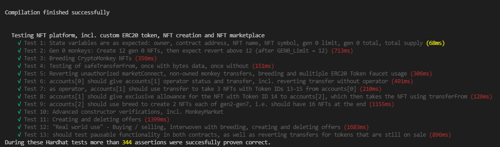

# NFT Platform Hardhat Tester
This is a unit testing project for NFT platforms, here applied to the [CryptoMonkey NFT platform](https://github.com/ctrl030/CryptoMonkeys), which includes everything to mint, burn, track and transfer CryptoMonkey NFTs, as well as a marketplace to trade them and a custom ERC20 Token for breeding and creating new NFTs. 

The unit testing runs through deployment and usage of the NFT platform, simulating and testing for possible errors, as well as the desired features. 
While a code audit is highly recommended for any web3 project, this method is very useful to find and fix bugs and unexpected dapp-behaviour early on.

## Table of Contents

- [Structure](#structure)   
- [Setup](#setup) 
- [Running tests](#running-tests)  

## Structure

### Smart Contracts / NFT platform to test

- **MonkeyContract.sol** is the main contract. It includes everything to mint, burn, track and transfer CryptoMonkey NFTs.
- **MonkeyMarketplace.sol** includes everything to create, fulfill and delete offers, so that users can buy and sell CryptoMonkey NFTs.
- **BananaToken.sol** is an ERC20 Token that users need to mint or breed their CryptoMonkey NFTs in the main contract. Also includes a faucet. 

To learn more about the project that is being tested, you can check the [CryptoMonkey NFT platform](https://github.com/ctrl030/CryptoMonkeys)

## Setup

You can follow these links to install the needed software:

- [Node.js](https://nodejs.org/en/)
- [Hardhat](https://hardhat.org/getting-started/#installation)

### Running tests 

- After installing Hardhat, navigate to the project directory and use a CLI to run ```npx hardhat test```

- The tests will be executed and their results will be displayed inside the command line terminal.

Randomness is simulated / pseudo-randomness at this point, mostly a placeholder for randomness-getting-functions, for ex. the Chainlink VRF.
